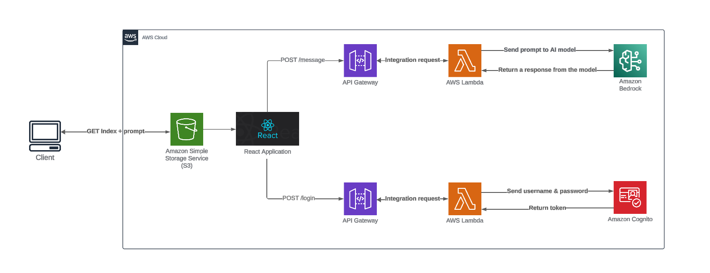

# 📚 Chat IA Generativa con AWS Bedrock

Este proyecto implementa un chat basado en IA generativa utilizando **AWS Bedrock**. La aplicación está desarrollada en **Node.js** y se despliega usando **AWS Lambda** y **API Gateway** para gestionar las solicitudes de los usuarios. La interfaz de usuario se almacena en un bucket de **Amazon S3** como una aplicación React.

## 📑 Tabla de Contenidos
- [Descripción del Proyecto](#📋-descripción-del-proyecto)
- [Arquitectura](#🏗️-arquitectura)
- [Requisitos](#📝-requisitos)
- [Despliegue](#🚀-despliegue)
- [Configuración](#🔧-configuración)
- [Uso](#🖥️-uso)
- [Mejoras Futuras](#🚀-mejoras-futuras)

## 📋 Descripción del Proyecto

El chat utiliza **AWS Bedrock** para procesar las entradas de los usuarios y generar respuestas en tiempo real. El backend se desarrolla como una función **AWS Lambda** que se integra con **API Gateway** para manejar las solicitudes HTTP. El frontend es una aplicación React alojada en **Amazon S3** que se conecta con las APIs mediante peticiones HTTP. Además, se implementa **AWS Cognito** para gestionar el inicio de sesión y la autenticación de usuarios, asegurando un acceso seguro y sencillo a la aplicación.

## 🏗️ Arquitectura

La arquitectura del proyecto consta de los siguientes componentes:

1. **Frontend**: Una aplicación React alojada en un bucket de S3 que actúa como la interfaz de usuario.
2. **API Gateway**: Maneja las solicitudes de los usuarios y las redirige a la función Lambda.
3. **AWS Lambda**: Función que procesa las solicitudes del API Gateway y llama a **AWS Bedrock** para generar las respuestas.
4. **AWS Bedrock**: Servicio de IA generativa de AWS que responde a las consultas de los usuarios.
5. **AWS Cognito**: Servicio que facilita la gestión de la autenticación y autorización de usuarios en aplicaciones web y móviles.

## 📝 Requisitos

- **Node.js** (v16 o superior)
- **AWS CLI** configurado con permisos adecuados
- **AWS Account** con acceso a **S3**, **API Gateway**, **Lambda** y **Bedrock**

## 🚀 Despliegue

El despliegue de la aplicación se gestiona mediante un **workflow de GitHub Actions**, que se activa al realizar un **push** a la rama `main` o manualmente usando `workflow_dispatch`. A continuación, se detallan los pasos para garantizar que el despliegue funcione correctamente:

### Pasos para el Despliegue:

1. **Configuración de Secrets en GitHub**:
   - Ve a **Settings > Secrets and variables > Actions** en tu repositorio de GitHub.
   - Agrega los siguientes secrets:
     - `AWS_ACCESS_KEY_ID`
     - `AWS_SECRET_ACCESS_KEY`
     - `AWS_REGION` (e.g., `us-east-1`)
     - `STAGE` (e.g., `dev`, `staging` o `prod`)
     - `COGNITO_USER_USERNAME` (Nombre de usuario del Administrador)
     - `COGNITO_USER_PASSWORD` (Contraseña del Administrador)

2. **Push de Código**:
   - Realiza un **push** a la rama `main` para activar el workflow y desplegar automáticamente.
   - Alternativamente, puedes iniciar el despliegue manualmente desde la pestaña **Actions** en GitHub.

3. **Acciones Automáticas del Workflow**:
   - **Instalación de dependencias**: Clona el repositorio y configura herramientas como AWS CLI y el Serverless Framework.
   - **Configuración de AWS CLI**: Autenticación con AWS usando las credenciales proporcionadas en los secrets.
   - **Despliegue de la aplicación**: Usa el comando `serverless deploy` para desplegar la Lambda y configurar los recursos en AWS.
   - **Subida de archivos a S3**: Sube el frontend al bucket configurado para que esté disponible públicamente.

Este proceso facilita la **Integración y Despliegue Continuo (CI/CD)** para la aplicación.

## 🔧 Configuración

### 🛠️ CORS

Asegúrate de que tanto tu bucket S3 como tu API Gateway tengan configuraciones de **CORS** adecuadas para permitir que el frontend se comunique con la API.

## 🖥️ Uso

- Accede a la URL pública de tu bucket S3 en un navegador para ver la interfaz de usuario del chat.
- Logeate con las credenciales de usuarios que creamos en Github Secrets, las cuales son **COGNITO_USER_USERNAME** y **COGNITO_USER_PASSWORD**
- Escribe mensajes, y la IA generativa responderá en tiempo real a través de **AWS Bedrock**.

## 🚀 Mejoras Futuras

- **💬 Almacenamiento de Conversaciones**: Usar **Amazon DynamoDB** para guardar y gestionar historiales de chat.
- **💰 Optimización de Costos**: Implementar estrategias de optimización para reducir costos en las interacciones con **Bedrock**.
